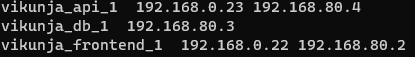
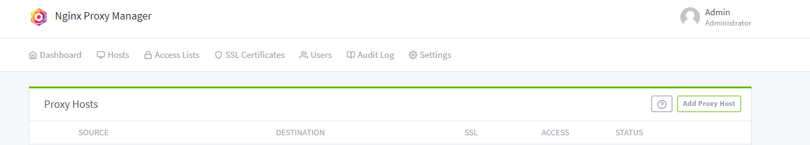
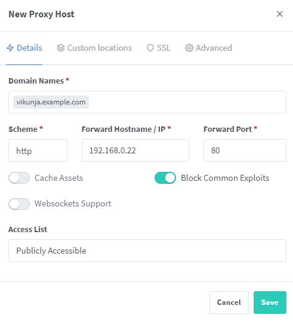
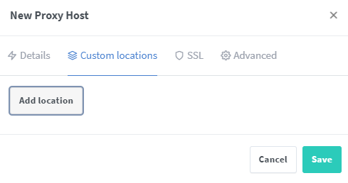
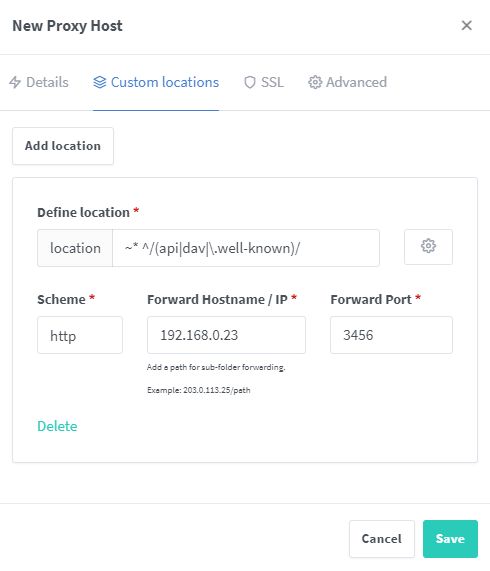
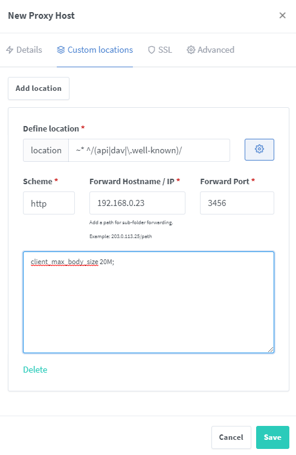
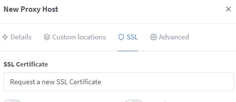

# Setup behind a reverse proxy which also serves the frontend

These examples assume you have an instance of the backend running on your server listening on port `3456`.
If you've changed this setting, you need to update the server configurations accordingly.



## NGINX

Below are two example configurations which you can put in your `nginx.conf`:

You may need to adjust `server_name` and `root` accordingly.

### with gzip enabled (recommended)


gzip  on;
gzip_disable "msie6";

gzip_vary on;
gzip_proxied any;
gzip_comp_level 6;
gzip_buffers 16 8k;
gzip_http_version 1.1;
gzip_min_length 256;
gzip_types text/plain text/css application/json application/x-javascript text/xml application/xml application/xml+rss text/javascript application/vnd.ms-fontobject application/x-font-ttf font/opentype image/svg+xml;

server {
    listen       80;
    server_name  localhost;

    location / {
        root   /path/to/vikunja/static/frontend/files;
        try_files $uri $uri/ /;
        index  index.html index.htm;
    }
    
    location ~* ^/(api|dav|\.well-known)/ {
        proxy_pass http://localhost:3456;
        client_max_body_size 20M;
    }
}


<div class="notification is-warning">
<b>NOTE:</b> If you change the max upload size in Vikunja's settings, you'll need to also change the <code>client_max_body_size</code> in the nginx proxy config.
</div>

### without gzip


server {
    listen       80;
    server_name  localhost;

    location / {
        root   /path/to/vikunja/static/frontend/files;
        try_files $uri $uri/ /;
        index  index.html index.htm;
    }
    
    location ~* ^/(api|dav|\.well-known)/ {
        proxy_pass http://localhost:3456;
        client_max_body_size 20M;
    }
}


<div class="notification is-warning">
<b>NOTE:</b> If you change the max upload size in Vikunja's settings, you'll need to also change the <code>client_max_body_size</code> in the nginx proxy config.
</div>

## NGINX Proxy Manager (NPM)

### Manually editing the config file

1. Create a standard Proxy Host for the Vikunja Frontend within NPM and point it to the URL you plan to use. The next several steps will enable the Proxy Host to successfully navigate to the API (on port 3456).
2. Verify that the page will pull up in your browser. (Do not bother trying to log in. It won't work. Trust me.)
3. Now, we'll work with the NPM container, so you need to identify the container name for your NPM installation. e.g. NGINX-PM
4. From the command line, enter `sudo docker exec -it [NGINX-PM container name] /bin/bash` and navigate to the proxy hosts folder where the `.conf` files are stashed. Probably `/data/nginx/proxy_host`. (This folder is a persistent folder created in the NPM container and mounted by NPM.)
5. Locate the `.conf` file where the server_name inside the file matches your Vikunja Proxy Host. Once found, add the following code, unchanged, just above the existing location block in that file. (They are listed by number, not name.)  
```
location ~* ^/(api|dav|\.well-known)/ {
        proxy_pass http://api:3456;
        client_max_body_size 20M;
    }
```
6. After saving the edited file, return to NPM's UI browser window and refresh the page to verify your Proxy Host for Vikunja is still online. 
7. Now, switch over to your Vikunja browswer window and hit refresh. If you configured your URL correctly in original Vikunja container, you should be all set and the browser will correctly show Vikunja. If not, you'll need to adjust the address in the top of the login subscreen to match your proxy address.

### Using the GUI

This guide puts everything in a custom docker network so no ports are exposed.
If your setup requires otherwise you will have to uncomment them.

```
version: '3'

services:
  db:
    image: postgres:13
    environment:
      POSTGRES_PASSWORD: secret
      POSTGRES_USER: vikunja
    volumes:
      - /path/to/vikunja/db:/var/lib/postgresql/data
    restart: unless-stopped
  api:
    image: vikunja/api
    environment:
      VIKUNJA_DATABASE_HOST: db
      VIKUNJA_DATABASE_PASSWORD: secret
      VIKUNJA_DATABASE_TYPE: postgres
      VIKUNJA_DATABASE_USER: vikunja
      VIKUNJA_DATABASE_DATABASE: vikunja
    #ports:
    #  - 3456:3456
    volumes: 
      - /path/to/vikunja/files:/app/vikunja/files
    depends_on:
      - db
    restart: unless-stopped
  frontend:
    image: vikunja/frontend
    #ports:
    #  - 80:80
    restart: unless-stopped
```

Create a `docker-compose.yml` file with the above content and run `docker-compose up -d`.

After it has spun up the containers it assigns them automatically a network `vikunja_default`.
For this setup to work you must assign the containers on the same network your NPM is.
If you have ports exposed in the yaml you don't have to.

You can find your NPM instance id by running `docker ps`:


and then run `docker inspect -f "{{json .NetworkSettings.Networks  }}" $INSTANCE_ID` to find the network name.

For example, let's say npm is running on `npm_default`
To assign the containers execute 

`docker network connect vikunja_api_1 npm_default `

`docker network connect vikunja_frontend_1 npm_default `

You don't have to assign the DB container, but be careful not to remove the `vikunja_default` network.

Check that everything is on the same network:

`docker ps -q | xargs -n 1 docker inspect --format '{{ .Name }} {{range .NetworkSettings.Networks}} {{.IPAddress}}{{end}}' | sed 's#^/##';`



So, in this case 
* `vikunja_api_1` is at 192.168.0.23
* `vikunja_frontend_1` is at 192.168.0.22
* `nginx proxy manager` is at  192.168.0.2

Just make sure to note that these IP addresses will be different on your system.
Just try to find them following the above command.

Now let's go to npm:

Click to Add a Proxy Host:



Then fill in the form:

- Your domain or subdomain of choice
- The vikunja frontend IP address as found before, alternatively you could assign the hostname of the container `vikunja_frontend_1`
- At port 80



Then move to the next tab Custom Locations and add a new location:



Fill the form:

- The same location as in the nginx configuration `~* ^/(api|dav|\.well-known)/`
- The vikunja api address in the Forward IP, alternatively you could assign the hostname of the container `vikunja_api_1` 
- At port 3456



Click the cog:



and add last line
`client_max_body_size 20M;`

Finally request a new SSL Certificate and Save your configuration!




## Apache

Put the following config in `cat /etc/apache2/sites-available/vikunja.conf`:


<VirtualHost *:80>
    ServerName localhost
   
    <Proxy *>
      Order Deny,Allow
      Allow from all
    </Proxy>
    ProxyPass /api http://localhost:3456/api
    ProxyPassReverse /api http://localhost:3456/api
    ProxyPass /dav http://localhost:3456/dav
    ProxyPassReverse /dav http://localhost:3456/dav
    ProxyPass /.well-known http://localhost:3456/.well-known
    ProxyPassReverse /.well-known http://localhost:3456/.well-known

    DocumentRoot /var/www/html
    RewriteEngine On
 	RewriteRule ^\/?(favicon\.ico|assets|audio|fonts|images|manifest\.webmanifest|robots\.txt|sw\.js|workbox-.*|api|dav|\.well-known) - [L]
    RewriteRule ^(.*)$ /index.html [QSA,L]
</VirtualHost>


**Note:** The apache modules `proxy`, `proxy_http` and `rewrite` must be enabled for this.

For more details see the [frontend apache configuration]().
